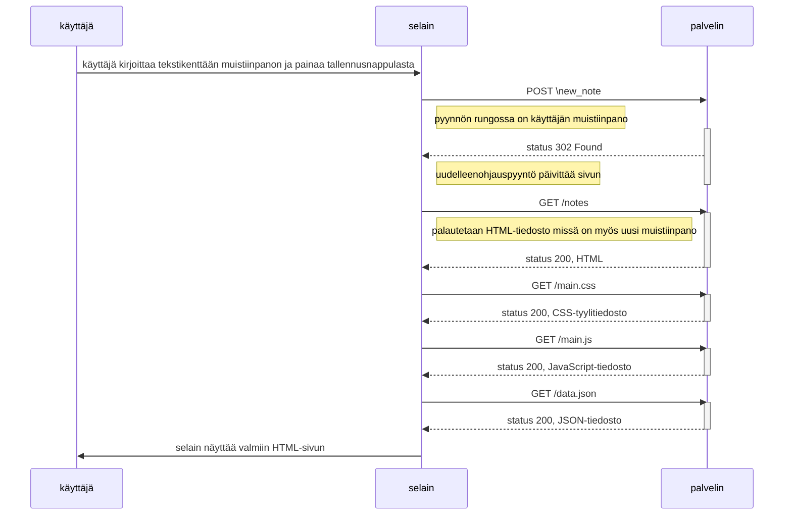

```mermaid
sequenceDiagram
    participant käyttäjä
    participant selain
    participant palvelin
    
    käyttäjä->>selain: käyttäjä kirjoittaa tekstikenttään muistiinpanon ja painaa tallennusnappulasta
    selain->>palvelin: POST \new_note
    Note right of selain: pyynnön rungossa on käyttäjän muistiinpano
    activate palvelin
    palvelin-->>selain: status 302 Found
    Note right of selain: uudelleenohjauspyyntö päivittää sivun
    deactivate palvelin
    
    selain->>palvelin: GET /notes
    activate palvelin
    Note right of selain: palautetaan HTML-tiedosto missä on myös uusi muistiinpano
    palvelin-->>selain: status 200, HTML
    deactivate palvelin
    
    selain->>palvelin: GET /main.css
    activate palvelin
    palvelin-->>selain: status 200, CSS-tyylitiedosto
    deactivate palvelin
    
    selain->>palvelin: GET /main.js
    activate palvelin
    palvelin-->>selain: status 200, JavaScript-tiedosto
    deactivate palvelin

    selain->>palvelin: GET /data.json
    activate palvelin
    palvelin-->>selain: status 200, JSON-tiedosto
    deactivate palvelin

    selain->>käyttäjä: selain näyttää valmiin HTML-sivun
```
