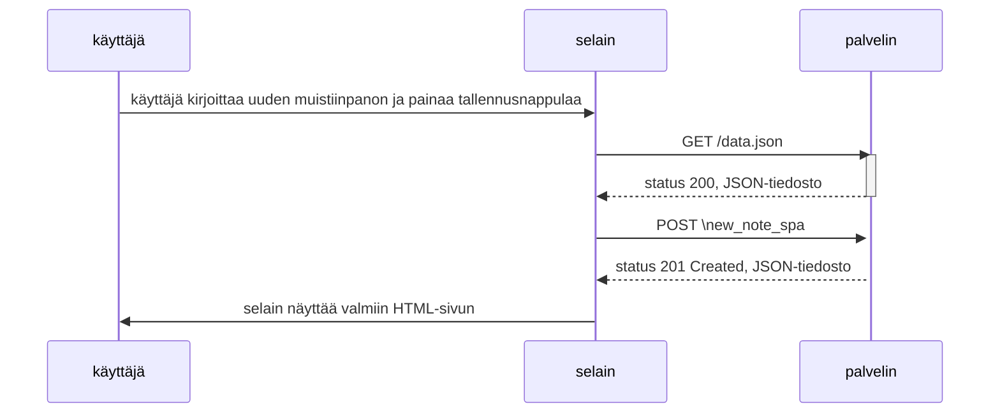

```mermaid 
sequenceDiagram
    participant käyttäjä
    participant selain
    participant palvelin
    
    käyttäjä->>selain: käyttäjä kirjoittaa uuden muistiinpanon ja painaa tallennusnappulaa
    
    selain->>palvelin: GET /data.json
    activate palvelin
    palvelin-->>selain: status 200, JSON-tiedosto
    deactivate palvelin
    activate palvelin
    selain->>palvelin: POST \new_note_spa
    palvelin-->>selain: status 201 Created, JSON-tiedosto

    selain->>käyttäjä: selain näyttää valmiin HTML-sivun
```
